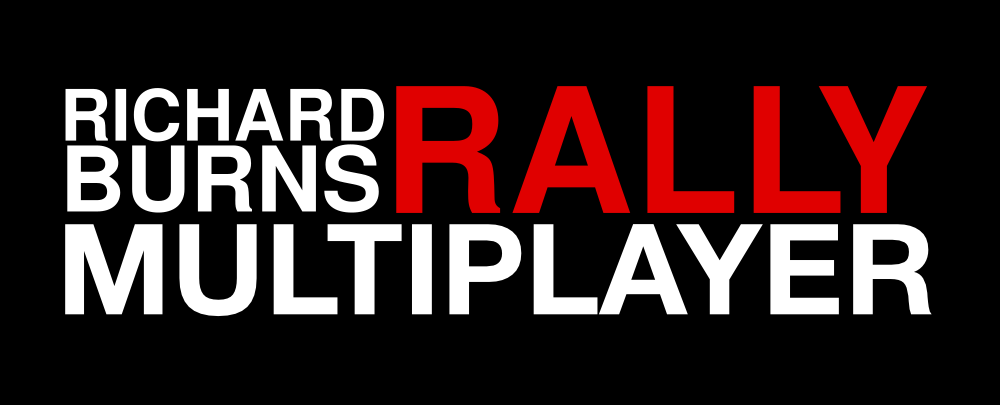

# RBR-MP-Server

<p>
  <em>The server half of a multiplayer mod for <strong>Richard Burns Rally</strong>:
  a small, dependency-free UDP relay in Go.</em>
</p>

It passes car state between players — pose, velocity, engine RPM, steering and
wheel speeds, and which car everyone drives — at a fixed tick rate over plain
UDP, with no authority and no physics: each client owns its own car and the
server only relays.

The client is a separate project: [RBR-MP-Client](../RBR-MP-Client) — a DLL
injected into the game that renders the other cars inside its own 3D scene,
wheels turning, shadows on the ground and engines audible where the cars are.

> A hobby project, not affiliated with or endorsed by the Richard Burns Rally
> team or RallySimFans.

---

## Quick start

```bash
go build ./cmd/rbrmp-server
./rbrmp-server                # listens on UDP :40100
```

Or with Docker, one command:

```bash
docker compose up -d
```

Open **UDP** port 40100 on the firewall — not TCP.

## Configuration

Everything is a flag; there is no config file to manage.

```
Usage of rbrmp-server:
  -addr string      UDP address to listen on (default ":40100")
  -tick int         snapshots per second sent to each client (default 30)
  -timeout duration drop a client silent for this long (default 5s)
  -stale duration   stop relaying a player whose newest state is older
                    than this, so others despawn him quickly (default 2s)
  -stats duration   how often to print a traffic line, 0 = never (default 10s)
  -v                log malformed datagrams and send errors
```

Cross-compiling for a Linux box:

```bash
GOOS=linux GOARCH=amd64 go build -o rbrmp-server ./cmd/rbrmp-server
```

## Installation

* **[docs/INSTALL.md](docs/INSTALL.md)** — the "play tonight" guide: prebuilt
  binaries from the release pages, local/LAN/internet setup, client install,
  troubleshooting.

## Deployment

* **[Dockerfile](Dockerfile)** — multi-stage build ending on `scratch`: a
  single static binary, a few megabytes, nothing to patch, runs as non-root.
* **[docker-compose.yml](docker-compose.yml)** — one-command deployment with
  the UDP port mapped, a memory cap, a read-only filesystem and all
  capabilities dropped. Tune the server through its `command:` line.
* **[docs/DEPLOYMENT.md](docs/DEPLOYMENT.md)** — the longer walkthrough:
  VPS setup, firewall, running it under systemd instead, and what to monitor.
* Every `v*` tag also triggers CI to build the release binaries and, on the
  server's own VPS, download and restart the service automatically — see
  [.github/workflows/release.yml](.github/workflows/release.yml).

## Design

**Self-hosted, not central.** The binary is meant to be run by whoever wants a
session, in the style of SAMP/MTA/FiveM — not as one server everyone connects
to. A single central server would need throughput nobody has volunteered, and
peer-to-peer would generate more support questions than races.

**No authority, no simulation.** Every client owns its own car; the server
stores what it is told and forwards it. Physics stay in the game, where they
belong. That also means there is nothing here to cheat *through* — and nothing
stopping a client from lying about where it is, which is fine for driving with
friends and not fine for a leaderboard.

**Clocks are never synchronised.** Clients timestamp their own packets with
their own clock; the server stores that number, drives everything off its own
receive clock, and hands the client's number back untouched. Each side can then
measure real latency using only the clock it owns.

**Dumb wire, smart edges.** The protocol is fixed-layout little-endian UDP with
no reliability layer: state is continuous, so a lost packet is simply replaced
by the next one. Interpolation, extrapolation and animation are the client's
job; the server only relays and replays.

## Measuring the delay without the game

`cmd/rbrmp-sim` is a fake client. It drives a circle, sends full v2 telemetry
exactly like the mod does (wheels turning, revs rising and falling — so a real
client's animation and audio can be tested against it), and reports the round
trip the server hands back in every snapshot:

```
$ ./rbrmp-server -tick 60 &
$ ./rbrmp-sim -for 5s
joined as player 1
round trip 8.7 ms over 60 snapshots

300 snapshots: average round trip 8.6 ms
```

**round trip** is how stale the server's picture of you is: the trip out, plus
however long your state waited for the next server tick, plus the trip back.
On loopback the tick wait is most of it, so this is not a ping.

There is no self-echo/replay player — an earlier version of the server fed
each client's own state back to it on a delay so the loop could be watched
with one machine, but it added enough complexity for what it bought that it
was removed (`Welcome.EchoDelayMs` still exists on the wire and is always `0`,
kept only so old and new peers don't reject each other's handshake). To see a
second car without a second PC, run a second `rbrmp-sim` instead.

`-rate`, `-speed`, `-radius` and `-car` change what the fake car does and
claims to be. Several instances can run at once to simulate a field of cars —
which is also how to test with company but no second machine.

## Protocol

Version 2: fixed-layout little-endian UDP, documented field-by-field in
**[docs/PROTOCOL.md](docs/PROTOCOL.md)**. The reference implementation is
`internal/protocol`, mirrored by the client's `src/net_protocol.cpp`.

A state packet is 112 bytes — about 6.7 kB/s per client at 60 Hz. A snapshot is
20 bytes plus 152 per entity. Version 2 added car identity and a telemetry
block (velocity, RPM, steering, gear, per-wheel angular velocity); version 1
carried pose and speed only.

## Repository layout

```
cmd/rbrmp-server/   the binary: flags, signals, wiring
cmd/rbrmp-sim/      fake game client for testing and measurement
internal/protocol/  the wire format: encode/decode, no I/O
internal/server/    the relay: session handling, tick loop, pose history
docs/               INSTALL.md, PROTOCOL.md, DEPLOYMENT.md
```

## Tests

```bash
go test ./...
```

The protocol tests are round trips and truncation checks. The server tests
stand up a real server on a real socket and drive it over UDP: joining,
relaying between clients, timeouts, and RTT measurement.

`go test -race` needs cgo and a C compiler; it has not been run on the machine
this was written on, so the concurrency has been reviewed by hand rather than
by tool. All shared state is behind one mutex, and the only fields read outside
it are set before a client is published into the map.

## Status and roadmap

Working: joining, relaying between any number of players, car identity, full
telemetry pass-through (wheels, RPM, steering, gear, velocity), timeouts,
traffic stats, the simulator, Docker deployment.

Not done yet:

- [ ] Stage identity, so players only see others on the same stage
- [ ] Spectator mode
- [ ] A server list, so sessions can be found rather than typed in
- [ ] Load testing — the tick loop builds and sends one snapshot per client
      per tick, which is O(clients²) work and the first thing that will hurt

## License

MIT — see [LICENSE](LICENSE).
